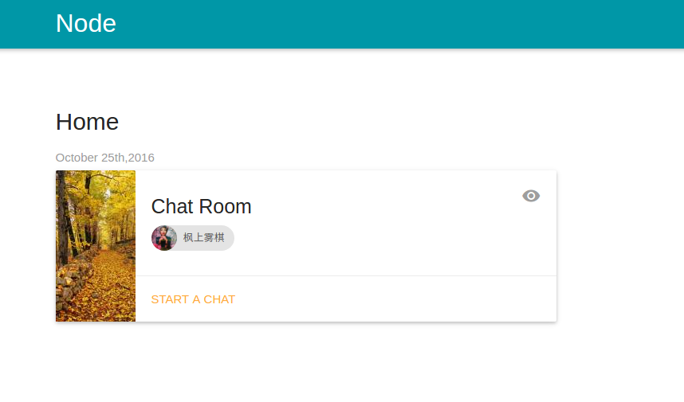

> # chat-node
一个简单的聊天系统，包含登录注册

## Screenshot

## Technology Stack
* NodeJS
* Express
* MongoDB
* Materialize

## Usage
* cd mongodb-linux-x86_64-ubuntu1604-3.4.4
* mkdir data && cd data && mkdir db && cd ..
* sudo ./bin/mongod --dbpath=data/db --rest
* sudo ./bin/mongo
* yarn install
* yarn start